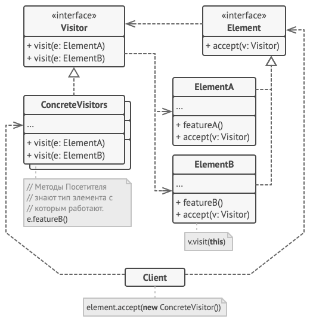
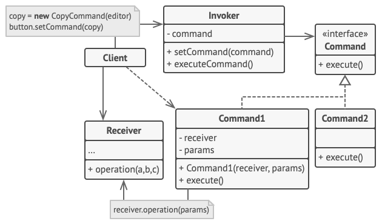
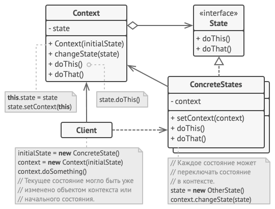

# Содержание
- [Содержание](#содержание)
- [Фасад](#фасад)
  - [Определение](#определение)
  - [Проблема](#проблема)
  - [Решение](#решение)
  - [Применимость](#применимость)
  - [Преимущества и недостатки](#преимущества-и-недостатки)
- [Строитель](#строитель)
  - [Определение](#определение-1)
  - [Проблема](#проблема-1)
  - [Решение](#решение-1)
  - [Применимость](#применимость-1)
  - [Преимущества и недостатки](#преимущества-и-недостатки-1)
- [Посетитель](#посетитель)
  - [Определение](#определение-2)
  - [Применимость](#применимость-2)
  - [Преимущества и недостатки](#преимущества-и-недостатки-2)
- [Команда](#команда)
  - [Определение](#определение-3)
  - [Проблема](#проблема-2)
  - [Решение](#решение-2)
  - [Применимость](#применимость-3)
  - [Преимущества и недостатки](#преимущества-и-недостатки-3)
- [Цепочка обязанностей](#цепочка-обязанностей)
  - [Определение](#определение-4)
  - [Проблема](#проблема-3)
  - [Решение](#решение-3)
  - [Применимость](#применимость-4)
  - [Преимущества и недостатки](#преимущества-и-недостатки-4)
- [Фабричный метод](#фабричный-метод)
  - [Определение](#определение-5)
  - [Проблема](#проблема-4)
  - [Решение](#решение-4)
  - [Применимость](#применимость-5)
  - [Преимущества и недостатки](#преимущества-и-недостатки-5)
- [Стратегия](#стратегия)
  - [Определение](#определение-6)
  - [Проблема](#проблема-5)
  - [Решение](#решение-5)
  - [Применимость](#применимость-6)
  - [Преимущества и недостатки](#преимущества-и-недостатки-6)
- [Состояние](#состояние)
  - [Определение](#определение-7)
  - [Проблема](#проблема-6)
  - [Решение](#решение-6)
  - [Применимость](#применимость-7)
  - [Преимущества и недостатки](#преимущества-и-недостатки-7)
- [Источники](#источники)

# Фасад
## Определение
>**Фасад** — это структурный паттерн проектирования, который предоставляет простой интерфейс к сложной системе классов, библиотеке или фреймворку.

## Проблема

Вашему коду приходится работать с большим количеством объектов некой сложной библиотеки или фреймворка. Вы должны самостоятельно инициализировать эти объекты, следить за правильным порядком зависимостей и так далее.

В результате бизнес-логика ваших классов тесно переплетается с деталями реализации сторонних классов. Такой код довольно сложно понимать и поддерживать.

## Решение

Фасад — это простой интерфейс для работы со сложной подсистемой, содержащей множество классов. Фасад может иметь урезанный интерфейс, не имеющий 100% функциональности, которой можно достичь, используя сложную подсистему напрямую. Но он предоставляет именно те фичи, которые нужны клиенту, и скрывает все остальные.

Фасад полезен, если вы используете какую-то сложную библиотеку со множеством подвижных частей, но вам нужна только часть её возможностей.

## Применимость

 Когда вам нужно представить простой или урезанный интерфейс к сложной подсистеме. 

:pencil: Часто подсистемы усложняются по мере развития программы. Применение большинства паттернов приводит к появлению меньших классов, но в большем количестве. Такую подсистему проще повторно использовать, настраивая её каждый раз под конкретные нужды, но вместе с тем, применять подсистему без настройки становится труднее. Фасад предлагает определённый вид системы по умолчанию, устраивающий большинство клиентов.

 Когда вы хотите разложить подсистему на отдельные слои. 

:pencil: Используйте фасады для определения точек входа на каждый уровень подсистемы. Если подсистемы зависят друг от друга, то зависимость можно упростить, разрешив подсистемам обмениваться информацией только через фасады.

## Преимущества и недостатки

|Преимущества|Недостатки|
|----|----|
|:heavy_check_mark: Изолирует клиентов от компонентов сложной подсистемы.|:x: Фасад рискует стать [божественным объектом](https://ru.wikipedia.org/wiki/%D0%91%D0%BE%D0%B6%D0%B5%D1%81%D1%82%D0%B2%D0%B5%D0%BD%D0%BD%D1%8B%D0%B9_%D0%BE%D0%B1%D1%8A%D0%B5%D0%BA%D1%82)

[:top: К содержанию](#содержание)
# Строитель
## Определение
>**Строитель** — это порождающий паттерн проектирования, который позволяет создавать сложные объекты пошагово. Строитель даёт возможность использовать один и тот же код строительства для получения разных представлений объектов.

## Проблема
Представьте сложный объект, требующий кропотливой пошаговой инициализации множества полей и вложенных объектов. Код инициализации таких объектов обычно спрятан внутри монструозного конструктора с десятком параметров. Либо ещё хуже — распылён по всему клиентскому коду.
## Решение
Паттерн Строитель предлагает вынести конструирование объекта за пределы его собственного класса, поручив это дело отдельным объектам, называемым строителями.  
Паттерн предлагает разбить процесс конструирования объекта на отдельные шаги. Чтобы создать объект, вам нужно поочерёдно вызывать методы строителя. Причём не нужно запускать все шаги, а только те, что нужны для производства объекта определённой конфигурации.
## Применимость

 Когда ваш код должен создавать разные представления какого-то объекта. 

:pencil: Строитель можно применить, если создание нескольких представлений объекта состоит из одинаковых этапов, которые отличаются в деталях.
Интерфейс строителей определит все возможные этапы конструирования. Каждому представлению будет соответствовать собственный класс-строитель. А порядок этапов строительства будет задавать класс-директор.

 Когда вам нужно собирать сложные составные объекты, например, деревья Компоновщика. 

:pencil: Строитель конструирует объекты пошагово, а не за один проход. Более того, шаги строительства можно выполнять рекурсивно. А без этого не построить древовидную структуру, вроде Компоновщика.
Заметьте, что Строитель не позволяет посторонним объектам иметь доступ к конструируемому объекту, пока тот не будет полностью готов. Это предохраняет клиентский код от получения незаконченных «битых» объектов.

## Преимущества и недостатки

|Преимущества|Недостатки|
|----|----|
|:heavy_check_mark: Позволяет создавать продукты пошагово.|:x: Усложняет код программы из-за введения дополнительных классов.|
|:heavy_check_mark: Позволяет использовать один и тот же код для создания различных продуктов.|:x: Клиент будет привязан к конкретным классам строителей, так как в интерфейсе директора может не быть метода получения результата.|
|:heavy_check_mark: Изолирует сложный код сборки продукта от его основной бизнес-логики.||

[:top: К содержанию](#содержание)
# Посетитель
## Определение
>**Посетитель** — это поведенческий паттерн проектирования, который позволяет добавлять в программу новые операции, не изменяя классы объектов, над которыми эти операции могут выполняться.

## Применимость

 Когда вам нужно выполнить какую-то операцию над всеми элементами сложной структуры объектов, например, деревом. 

:pencil: Посетитель позволяет применять одну и ту же операцию к объектам различных классов.

 Когда над объектами сложной структуры объектов надо выполнять некоторые не связанные между собой операции, но вы не хотите «засорять» классы такими операциями. 

:pencil: Посетитель позволяет извлечь родственные операции из классов, составляющих структуру объектов, поместив их в один класс-посетитель. Если структура объектов является общей для нескольких приложений, то паттерн позволит в каждое приложение включить только нужные операции.

 Когда новое поведение имеет смысл только для некоторых классов из существующей иерархии. 

:pencil: Посетитель позволяет определить поведение только для этих классов, оставив его пустым для всех остальных.

## Преимущества и недостатки

|Преимущества|Недостатки|
|----|----|
|:heavy_check_mark: Упрощает добавление операций, работающих со сложными структурами объектов.|:x: Паттерн не оправдан, если иерархия элементов часто меняется.|
|:heavy_check_mark: Объединяет родственные операции в одном классе.|:x: Может привести к нарушению инкапсуляции элементов.|
|:heavy_check_mark: Посетитель может накапливать состояние при обходе структуры элементов.||

[:top: К содержанию](#содержание)
# Команда
## Определение
>**Команда** — это поведенческий паттерн проектирования, который превращает запросы в объекты, позволяя передавать их как аргументы при вызове методов, ставить запросы в очередь, логировать их, а также поддерживать отмену операций.

## Проблема
## Решение
## Применимость

 Когда вы хотите параметризовать объекты выполняемым действием. 

:pencil: Команда превращает операции в объекты. А объекты можно передавать, хранить и взаимозаменять внутри других объектов.

 Когда вы хотите ставить операции в очередь, выполнять их по расписанию или передавать по сети. 

:pencil: Как и любые другие объекты, команды можно сериализовать, то есть превратить в строку, чтобы потом сохранить в файл или базу данных. Затем в любой удобный момент её можно достать обратно, снова превратить в объект команды и выполнить. Таким же образом команды можно передавать по сети, логировать или выполнять на удалённом сервере.

 Когда вам нужна операция отмены. 

:pencil: Главная вещь, которая вам нужна, чтобы иметь возможность отмены операций, — это хранение истории. Среди многих способов, которыми можно это сделать, паттерн Команда является, пожалуй, самым популярным.

## Преимущества и недостатки

|Преимущества|Недостатки|
|----|----|
|:heavy_check_mark: Убирает прямую зависимость между объектами, вызывающими операции, и объектами, которые их непосредственно выполняют.|:x: Усложняет код программы из-за введения множества дополнительных классов.|
|:heavy_check_mark: Позволяет реализовать простую отмену и повтор операций.||
|:heavy_check_mark: Позволяет реализовать отложенный запуск операций.||
|:heavy_check_mark: Позволяет собирать сложные команды из простых.||
|:heavy_check_mark: Реализует принцип открытости/закрытости.||

[:top: К содержанию](#содержание)
# Цепочка обязанностей
## Определение
>**Цепочка обязанностей** — это поведенческий паттерн проектирования, который позволяет передавать запросы последовательно по цепочке обработчиков. Каждый последующий обработчик решает, может ли он обработать запрос сам и стоит ли передавать запрос дальше по цепи.

## Проблема
## Решение
## Применимость

 Когда программа должна обрабатывать разнообразные запросы несколькими способами, но заранее неизвестно, какие конкретно запросы будут приходить и какие обработчики для них понадобятся. 

:pencil: С помощью Цепочки обязанностей вы можете связать потенциальных обработчиков в одну цепь и при получении запроса поочерёдно спрашивать каждого из них, не хочет ли он обработать запрос.

 Когда важно, чтобы обработчики выполнялись один за другим в строгом порядке. 

:pencil: Цепочка обязанностей позволяет запускать обработчиков последовательно один за другим в том порядке, в котором они находятся в цепочке.

 Когда набор объектов, способных обработать запрос, должен задаваться динамически. 

:pencil: В любой момент вы можете вмешаться в существующую цепочку и переназначить связи так, чтобы убрать или добавить новое звено.

## Преимущества и недостатки
|Преимущества|Недостатки|
|----|----|
|:heavy_check_mark: Уменьшает зависимость между клиентом и обработчиками.|:x: Запрос может остаться никем не обработанным.|
|:heavy_check_mark: Реализует принцип единственной обязанности.||
|:heavy_check_mark: Реализует принцип открытости/закрытости.||

[:top: К содержанию](#содержание)
# Фабричный метод
## Определение
> **Фабричный метод** — это порождающий паттерн проектирования, который определяет общий интерфейс для создания объектов в суперклассе, позволяя подклассам изменять тип создаваемых объектов.

:exclamation: В Go невозможно реализовать классический вариант паттерна Фабричный метод, поскольу в языке отсутствуют возможности ООП, в том числе классы и наследственность. Несмотря на это, мы все же можем реализовать базовую версию этого паттерна — Простая фабрика.

## Проблема
## Решение
## Применимость

 Когда заранее неизвестны типы и зависимости объектов, с которыми должен работать ваш код. 

:pencil: Фабричный метод отделяет код производства продуктов от остального кода, который эти продукты использует.

Благодаря этому, код производства можно расширять, не трогая основной. Так, чтобы добавить поддержку нового продукта, вам нужно создать новый подкласс и определить в нём фабричный метод, возвращая оттуда экземпляр нового продукта.

 Когда вы хотите дать возможность пользователям расширять части вашего фреймворка или библиотеки. 

:pencil: Пользователи могут расширять классы вашего фреймворка через наследование. Но как сделать так, чтобы фреймворк создавал объекты из этих новых классов, а не из стандартных?

Решением будет дать пользователям возможность расширять не только желаемые компоненты, но и классы, которые создают эти компоненты. А для этого создающие классы должны иметь конкретные создающие методы, которые можно определить.

 Когда вы хотите экономить системные ресурсы, повторно используя уже созданные объекты, вместо порождения новых. 

:pencil: Такая проблема обычно возникает при работе с тяжёлыми ресурсоёмкими объектами, такими, как подключение к базе данных, файловой системе и т. д.

## Преимущества и недостатки
|Преимущества|Недостатки|
|----|----|
|:heavy_check_mark: Избавляет класс от привязки к конкретным классам продуктов.|:x: Может привести к созданию больших [параллельных иерархий классов](https://refactoring.guru/ru/smells/parallel-inheritance-hierarchies), так как для каждого класса продукта надо создать свой подкласс создателя.|
|:heavy_check_mark: Выделяет код производства продуктов в одно место, упрощая поддержку кода.||
|:heavy_check_mark: Упрощает добавление новых продуктов в программу.||
|:heavy_check_mark: Реализует принцип открытости/закрытости.||

[:top: К содержанию](#содержание)
# Стратегия
## Определение
>**Стратегия** — это поведенческий паттерн проектирования, который определяет семейство схожих алгоритмов и помещает каждый из них в собственный класс, после чего алгоритмы можно взаимозаменять прямо во время исполнения программы.

## Проблема
## Решение
## Применимость

 Когда вам нужно использовать разные вариации какого-то алгоритма внутри одного объекта. 

:pencil: Стратегия позволяет варьировать поведение объекта во время выполнения программы, подставляя в него различные объекты-поведения (например, отличающиеся балансом скорости и потребления ресурсов).

 Когда у вас есть множество похожих классов, отличающихся только некоторым поведением. 

:pencil: Стратегия позволяет вынести отличающееся поведение в отдельную иерархию классов, а затем свести первоначальные классы к одному, сделав поведение этого класса настраиваемым.

 Когда вы не хотите обнажать детали реализации алгоритмов для других классов. 

:pencil: Стратегия позволяет изолировать код, данные и зависимости алгоритмов от других объектов, скрыв эти детали внутри классов-стратегий.

 Когда различные вариации алгоритмов реализованы в виде развесистого условного оператора. Каждая ветка такого оператора представляет собой вариацию алгоритма. 

:pencil: Стратегия помещает каждую лапу такого оператора в отдельный класс-стратегию. Затем контекст получает определённый объект-стратегию от клиента и делегирует ему работу. Если вдруг понадобится сменить алгоритм, в контекст можно подать другую стратегию.

## Преимущества и недостатки
|Преимущества|Недостатки|
|----|----|
|:heavy_check_mark: Горячая замена алгоритмов на лету.|:x: Усложняет программу за счёт дополнительных классов.|
|:heavy_check_mark: Изолирует код и данные алгоритмов от остальных классов.|:x: Клиент должен знать, в чём состоит разница между стратегиями, чтобы выбрать подходящую.|
|:heavy_check_mark: Уход от наследования к делегированию.||
|:heavy_check_mark: Реализует принцип открытости/закрытости.||

[:top: К содержанию](#содержание)
# Состояние
## Определение
>**Состояние** — это поведенческий паттерн проектирования, который позволяет объектам менять поведение в зависимости от своего состояния. Извне создаётся впечатление, что изменился класс объекта.

## Проблема
## Решение
## Применимость

 Когда у вас есть объект, поведение которого кардинально меняется в зависимости от внутреннего состояния, причём типов состояний много, и их код часто меняется. 

:pencil: Паттерн предлагает выделить в собственные классы все поля и методы, связанные с определёнными состояниями. Первоначальный объект будет постоянно ссылаться на один из объектов-состояний, делегируя ему часть своей работы. Для изменения состояния в контекст достаточно будет подставить другой объект-состояние.

 Когда код класса содержит множество больших, похожих друг на друга, условных операторов, которые выбирают поведения в зависимости от текущих значений полей класса. 

:pencil: Паттерн предлагает переместить каждую ветку такого условного оператора в собственный класс. Тут же можно поселить и все поля, связанные с данным состоянием.

 Когда вы сознательно используете табличную машину состояний, построенную на условных операторах, но вынуждены мириться с дублированием кода для похожих состояний и переходов. 

:pencil: Паттерн Состояние позволяет реализовать иерархическую машину состояний, базирующуюся на наследовании. Вы можете отнаследовать похожие состояния от одного родительского класса и вынести туда весь дублирующий код.

## Преимущества и недостатки
|Преимущества|Недостатки|
|----|----|
|:heavy_check_mark: Избавляет от множества больших условных операторов машины состояний.|:x: Может неоправданно усложнить код, если состояний мало и они редко меняются.|
|:heavy_check_mark: Концентрирует в одном месте код, связанный с определённым состоянием.||
|:heavy_check_mark: Упрощает код контекста.||

[:top: К содержанию](#содержание)
# Источники

https://refactoring.guru/ru
